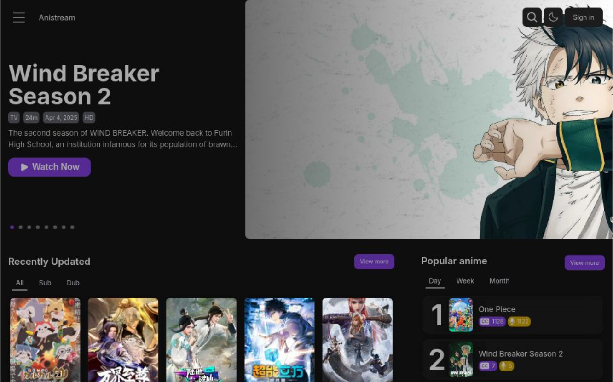

# Anistream 🎬


## 📖 Introduction

Anistream is a modern, responsive Anime streaming platform crafted specifically for anime enthusiasts. Built with Next.js and the NextUI ecosystem, it delivers a high-performance, seamless viewing experience. The platform features a sleek, intuitive interface designed to put content front and center. Users can easily navigate through a dynamic hero showcase for top releases, browse recently updated episodes with quick "Sub" and "Dub" filtering, and track trending shows via daily, weekly, and monthly leaderboards.



**Live Demo:** [https://anistream-iota.vercel.app](https://anistream-iota.vercel.app)

---

## ✨ Features

- **Extensive Anime Library**: Stream a wide variety of anime titles with data powered seamlessly by the **Aniwatch API**.
- **Intuitive Discovery**: Browse recently updated episodes, filter by sub/dub, and view trending shows across different timeframes.
- **Search Functionality**: Quickly find your favorite anime with the integrated search page.
- **User Authentication**: Secure sign-in and sign-out functionality to manage user sessions.
- **Watch History**: Keep track of the episodes you've watched, so you never lose your place.
- **Theme Switcher**: Choose your preferred viewing experience with customizable themes (including a polished Dark Mode).
- **Modern UI**: Crafted with Tailwind CSS and NextUI for a beautiful, responsive, and intuitive interface.

## ⚠️ Project Status

This project is currently unmaintained.
Development has been paused, and no new features or updates are planned at this time. The original author has mentioned the possibility of a complete rewrite in the future using a more modern technology stack.

## 🛠️ Tech Stack

- **Framework**: [Next.js](https://nextjs.org/) (App Router)
- **Library**: [React](https://reactjs.org/)
- **Language**: [TypeScript](https://www.typescriptlang.org/)
- **Styling**: [Tailwind CSS](https://tailwindcss.com/) & [NextUI](https://nextui.org/)
- **Database / ORM**: [Prisma](https://www.prisma.io/)
- **Anime API**: Aniwatch API

## 🚀 Getting Started

Follow these instructions to get a copy of the project up and running on your local machine for development and testing purposes.

### Prerequisites

Make sure you have Node.js and npm (or yarn/pnpm) installed on your system.

### Installation

1. Clone the repository:
   ```bash
   git clone [https://github.com/photonrays/Anistream.git](https://github.com/photonrays/Anistream.git)
   ```
2. Navigate into the project directory:
   ```bash
   cd Anistream
   ```
3. Install the dependencies:
   ```bash
   npm install
   # or yarn install
   # or pnpm install
   ```
4. Set up the Environment Variables:
   - Copy the .env.example file and rename it to .env.
   - Fill in your specific environment variables (e.g., Database URLs for Prisma, Auth secrets).
   ```bash
   cp .env.example .env
   ```
5. Run the development server:
   ```bash
   npm run dev
   # or yarn dev
   # or pnpm dev
   ```
6. Open http://localhost:3000 with your browser to see the application in action.

## 📁 Project Structure

Here is a brief overview of the project structure:
   - app/: Next.js App Router directory containing the main application pages and layouts.
   - components/: Reusable React components used throughout the application.
   - sections/: Larger page sections or modules (e.g., Hero section, Popular Anime lists).
   - services/: API integration and data fetching logic.
   - data/ & lib/: Helper functions, constants, and utilities.
   - hooks/: Custom React hooks for shared logic.
   - prisma/: Prisma ORM schema and database configuration.
   - types/: TypeScript type definitions.

## 📜 License
This project is licensed under the MIT License - see the [LICENSE](LICENSE) file for details.   
